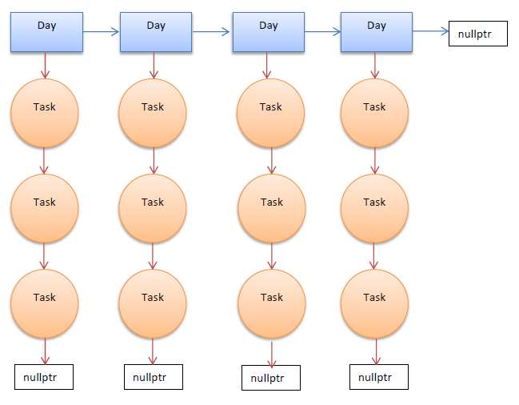

# Todo-List
Final project of Programming classes in third semester of Computer Science studies.

Project is written in the C++ language and works entirely in a console. As a students we couldn't use STL containers, so the class *Days_List* stores a linked list of *Day* objects, whereas those objects store linked lists of *Tasks* for a particular day.

## How does the program work? 

After running the Todo-List, the program retrieves the data of scheduled activities for particular days from *schedule.csv* file. Then a user sees menu of different options to choose:
1. *Show all the tasks.* - That feature displays in a clear way all scheduled activities saved in the file.
2. *Add a new task.* - This option allows a user to add a new task to the *Todo List*. After entering all the data and approving it, the program, thanks to my original algorithm, places the task in the right place.
3. *Show all the tasks for the particular day.* - Similar to the first option, the program displays all planned activities, but this time for the date entered by the user.
4. *Delete the task.* - The user enters information about the date and name of the task he wants to delete.
5. *Close the application. All of the changes will be saved*
